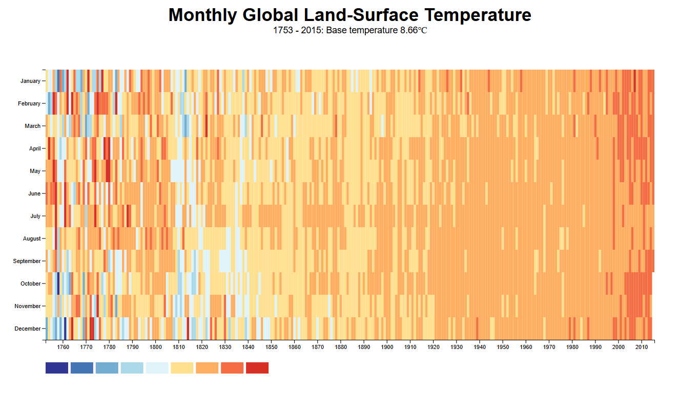

# 🔥 Global Temperature Heatmap (D3.js)

This project visualizes global temperature variances from 1753 to 2015 using a heatmap built with [D3.js](https://d3js.org/). Each cell represents the temperature variance for a specific month and year, colored based on the actual temperature.

## 📊 Features

- Interactive heatmap with tooltips
- Dynamic X and Y axes representing years and months
- Color-coded cells using a temperature threshold scale
- Detailed legend for interpreting color mapping

## 🔧 Technologies Used

- HTML
- CSS
- JavaScript
- D3.js v7
- [Global Temperature Dataset](https://raw.githubusercontent.com/freeCodeCamp/ProjectReferenceData/master/global-temperature.json)

## 📷 Preview

## 🔗 Live Demo

[Click here to view the live project](https://tapubormon.github.io/heat-map-d3/)

